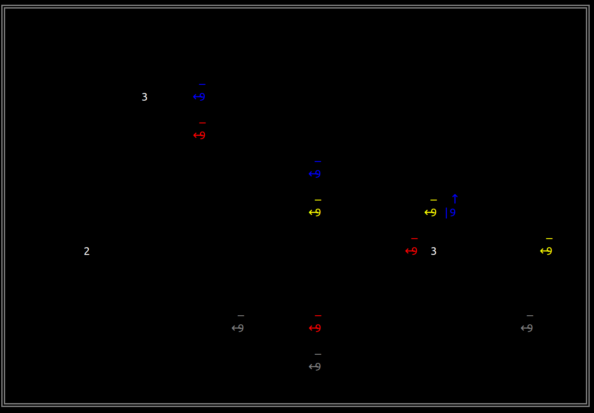

# Battle-Bots: a Rust training

This is a gamified training to introduce Rust in a playful way.


## Welcome!

Welcome to the latest edition of Battle-Bots! As always, we have the greatests bots battling each other:

- Yellow
- Red
- Grey
- Blue

Let's go ahead and run the battle:



Oh-oh... We seem to have technical difficulties... Yellow, Red and Grey are malfunctioning! They appear to be stuck!

We need your help!

## Your goals

Go in `src/main.rs`, and follow the instructions from top to bottom:

1. Fix the Yellow bot.
   - Go to `src/yellow.rs`, and follow the instructions.
2. Fix the Grey bot.
   - Go to `src/grey.rs`, and follow the instructions.
3. Fix the Red bot.

   - Go to `src/red.rs`, and follow the instructions.

4. Code your own decision making algorithm for Blue, and beat the other colors!
   - Go to `src/blue.rs`, and follow the instructions.

## Rules of the game

- At the beginning of the game, there are 3 bots of 4 different colors, battling in a world of 10x30 cells.
- Each bot has an energy level, starting with 9.
  - When the energy level of the Bot reaches 0, the bot loses.
  - The number of the bot in the terminal is its energy level.
- Each bot has a chainsaw with which to attack the enemies.
  - The chainsaw is represented as the arrow in the terminal (`↓`, `↑`, `←`, `→`).
- Each bot has a shield with which to defend itself.

  - The shield is represented by a bar (`|` or `—`).
  - If both the chainsaw and the shield are in the same direction, then they are represented with an arrow with a bar (`⤈`, `⤉`, `⇷`, `⇸`).

- Each turn, every bot decides to activate some actuators or not. There are 3 actuators:

  - Move: bots can only move to one of its **adjacent positions (up, down, left or right)**.
    - Each time the bot moves 6 steps, it gets tired and loses 1 energy.
  - Rotate its chainsaw: clockwise or counterclockwise, a bot can attack an enemy:
    - The chainsaw only makes damage when it is rotated towards an adjacent enemy, not when it's still in the direction of an enemy.
  - Rotate its shield: also clockwise or counterclockwise:
    - If the shield is in the direction of an adjacent attacking chainsaw, it will block the attack.
    - The shield can resist some attacks from enemy chainsaws, but will be destroyed if it receives too many attacks.

- Each turn, there is a possibility of resources spawning in any cell. Each resource contains an energy level.
  - **Resources are white**, and its energy level is its number.
- Whenever a bot moves into a space occupied by a resource, it consumes it and adds its energy gain to its own energy level.

## Running a battle

Make sure you have rust installed.

If you are running Ubuntu, make sure you have x11 installed: `sudo apt-get install libx11-dev`

```bash
cargo run
```
